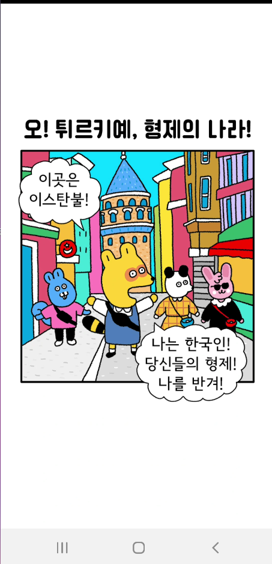

# FlutterToon [FTOON]
### NaverWeebToon 월별 모음집



## 프로젝트 요약
 
> 2023.01.03 - 2023.01.17   
 
> **Flutter 개인 프로젝트**
* 노마드 코더 Flutter 활용 강좌 내에 있는 플러터 웹툰 프로젝트입니다.(강좌 보면서 하지 않고 어려운 부분만 참조하여 제작)
* 강좌 내에 제공한 WebToon API의 오늘의 웹툰, 웹툰 일련 번호, 웹툰 회차 정보를 client단에서 Model로 변환하여 json데이터를 가지고 옵니다
* http 패키지를 활용하여 client단에서의 request 처리를 webtoon api 서버가 response를 문제없이 진행하였는 지 확인합니다.
* Card Widget의 ListView 형태의 thumbnail을 웹툰의 메인 UI로 설정하였습니다.
* 상세화면에서는 각 회차 버튼을 클릭하면 api service에 의하여 네이버 웹툰으로 이동하여 해당 회차를 보여줍니다.
* 좋아요(하트)버튼을 누르고 앱을 나간 상태에서 다시 빌드하게 되면 setState()에 의하여 눌렀던 상태가 계속해서 유지됩니다.
<br>

## Dependency
- `http`:  <a target="_blank" href="https://pub.dev/packages/http">https://pub.dev/packages/http</a>
- `url_launcher`:  <a target="_blank" href="https://pub.dev/packages/url_launcher">https://pub.dev/packages/url_launcher</a>
- `shared_preferences`:  <a target="_blank" href="https://pub.dev/packages/shared_preferences">https://pub.dev/packages/shared_preferences</a>


## 시작하려면
```dart
class ApiServices {
  //Api 주소
  static const String baseUrl =
      "https://webtoon-crawler.nomadcoders.workers.dev/";
  static const String today = "today"; // today's weebtoon list

  static Future<List<WebtoonModel>> getToodaysToons() async {
    List<WebtoonModel> webtoonInstances = []; // webtoon empty list
    final url = Uri.parse('$baseUrl$today'); // https://webtoon-crawler.nomadcoders.workers.dev/today/
    final response = await http.get(url);
    // application client and webtoon server connect success!!
    if (response.statusCode == 200) {
      final webtoons = jsonDecode(response.body);
      for (var webtoon in webtoons) {
        final instance = WebtoonModel.fromJson(webtoon);
        webtoonInstances.add(instance);
      }
      return webtoonInstances; // webtoon list return
    }
    throw Error(); // if status(500) is occured error occur
  }

  static Future<WebtoonDetailModel> getToonById(String id) async {
    final url = Uri.parse("$baseUrl$id"); // https://webtoon-crawler.nomadcoders.workers.dev/id/
    final response = await http.get(url);
     // application client and webtoon server connect success!!
    if (response.statusCode == 200) {
      final webtoon = jsonDecode(response.body);
      return WebtoonDetailModel.fromJson(webtoon);
    }
    throw Error(); // if status(500) is occured error occur
  }

  static Future<List<WebtoonEpsiodeModel>> getLatestEpisodesById(
      String id) async {
    List<WebtoonEpsiodeModel> episodesInstances = [];
    final url = Uri.parse("$baseUrl$id/episodes"); // https://webtoon-crawler.nomadcoders.workers.dev/id/episodes
    final response = await http.get(url);
    if (response.statusCode == 200) {
      final episodes = jsonDecode(response.body);
      for (var episode in episodes) {
        episodesInstances.add(WebtoonEpsiodeModel.fromJson(episode));
      }
      return episodesInstances;
    }
    throw Error();
  }
}
```
## API 주소
https://webtoon-crawler.nomadcoders.workers.dev/

## 시연영상
https://www.youtube.com/watch?v=-xOpnVjeleY
